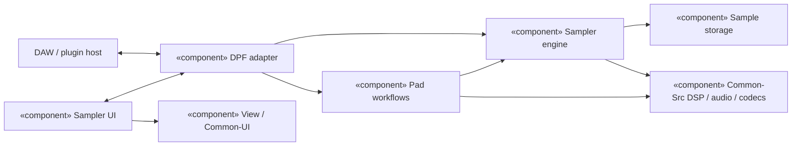
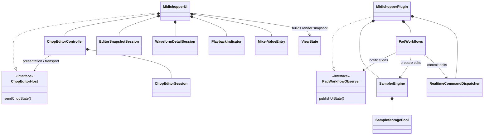

# Technical Architecture

SMS-Plugins builds native Linux audio plugins. Its current instrument,
SMS-Anvil Sampler, separates audio processing, host integration, and the user
interface. VST3 is the preferred format; DPF supplies the format wrappers.

## Components

The adapter translates parameters, MIDI, state, and lifecycle calls. It delegates
file import/export, clipboard, and pad-edit transactions to a control-thread
workflow controller. The engine owns capture timing, voices, pad publication,
and logical capacity. Its storage pool owns PCM and physical capture blocks.
The UI coordinates host communication; focused controllers own editor workflows
and interaction state. `MidichopperView.cpp` draws `ViewState` snapshots through
a free function.

## Classes and responsibilities

`SampleStoragePool` owns capture reserve, immutable imports, block maps and
reclamation. `PadWorkflows` owns clipboard snapshots and split plans.
`ChopEditorController` owns cut/split opening, navigation, preview and Apply.
`EditorSnapshotSession` matches waveform/settings replies;
`WaveformDetailSession` owns zoom and detail requests. `PlaybackIndicator`
tracks displayed playback, and `MixerValueEntry` handles numeric editing.

## Thread boundaries

Audio uses preallocated storage. It does not allocate, free, lock, wait, perform
I/O or throw. Control work prepares immutable audio and asks the audio owner to
commit bounded changes at block boundaries. Generations reject stale edits.
Raw-preview requests use a three-slot latest-value mailbox: play/stop, pads and
frame bounds remain one coherent value even when a newer request supersedes it.

VST3 uses an instance-owned control worker and a bounded UI message bus. LV2 uses
its host worker and state callbacks. Waveform scans and file I/O stay outside
the audio callback. `Common-Src` remains independent of DPF and this instrument;
DPF-specific reusable drawing belongs to `Common-UI`.

## Reading the implementation

Start with the [engine](../SMS-AnvilSampler/src/core/SamplerEngine.hpp),
[storage pool](../SMS-AnvilSampler/src/core/SampleStoragePool.hpp),
[pad workflows](../SMS-AnvilSampler/src/plugin/PadWorkflows.hpp), and
[cut editor](../SMS-AnvilSampler/src/ui/ChopEditorController.hpp).
The [engineering reference](../SMS-AnvilSampler/Docs/ARCHITECTURE.md) describes
MIDI, capture and state contracts; the [storage contract](AI/PAD-STORAGE.md)
details ownership. The [quality review](QUALITY-REVIEW.md) evaluates strengths,
tradeoffs and remaining limits. Public version compatibility is defined in the
[release procedure](RELEASING.md#public-version-compatibility).
