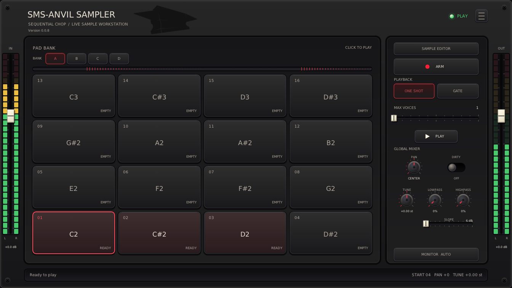

# SudoMetalStudio Plugins

_Professionally developed, **Linux-native** audio plugins._
Windows and macOS versions may follow later.

> Like many modern **professional** developers, I too use AI-assisted development tools - and I don't hide it, as some do, for fear of being shunned.
>
> Today's AI tools make software development more accessible than ever, but they also give experienced developers extraordinarily powerful tools for turning ideas into real, maintainable products. AI doesn't replace engineering experience, architecture, testing, judgment, or responsibility for the end result.
>
> _For many of us, it's the extra pair of hands we always wished we had._
>

I choose **quality over quantity**. Slow and steady. I only build what I'm also willing and able to maintain. The focus is on usability and simple, clear functionality.

## Plugins

- [SMS-Anvil Sampler](SMS-AnvilSampler/README.md) — live stereo chopping sampler
  for LV2 and VST3.




## Quick Start: AI autopilot in an isolated container

> For those interested in learning containerized AI-driven development, here's a quick start for you. You are more than welcome to fork and learn, but please note:
>
> **I do NOT take pull requests**.
>

Requirements: Ubuntu Linux and a ChatGPT plan with Codex access, such as Plus.

1. Install [Visual Studio Code](https://code.visualstudio.com/) and its
   [Dev Containers extension](https://marketplace.visualstudio.com/items?itemName=ms-vscode-remote.remote-containers).

2. Install Docker and add your user to its group:

   ```bash
   sudo apt update
   sudo apt install docker.io
   sudo systemctl enable --now docker
   sudo usermod -aG docker "$USER"
   sudo reboot
   ```

   **Reboot before opening VS Code.** Logging out may leave VS Code background processes without Docker permission.

3. Clone and open the repository:

   ```bash
   git clone --recurse-submodules https://github.com/sirsipe/SMS-Plugins.git
   code SMS-Plugins
   ```

4. In VS Code, run **Dev Containers: Reopen in Container**. The first image
   build downloads the complete audio, GUI, and AI toolchain and can take
   several minutes. Later starts are much faster.

5. Open the Codex panel on the right and sign in. Select **Full access** for the
   isolated container and choose a model available to your account. Start with
   the default reasoning effort; increase it when a task needs deeper analysis.

6. Try this prompt:

   > Hello! Make the ARM button of SMS-Anvil Sampler red, test it, and show me a
   > picture of how it looks.

7. (*Optional*) - To satisfy your curiosity, follow the agent's virtual screen at
   [http://localhost:6080/vnc.html](http://localhost:6080/vnc.html).

Inside the container, an AI agent can build and install the plugin, run its
tests, launch Carla, operate the real plugin UI, and capture window-only
screenshots. Docker provides the outer safety boundary for Full access: the
agent can change this checkout and use the network, but receives no host home,
display, audio, Docker socket, private keys, or unrelated repositories.

See [Contributing](CONTRIBUTING.md) for manual development and validation.
