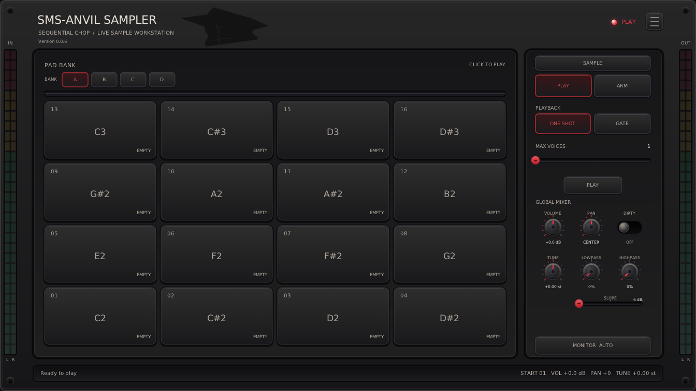
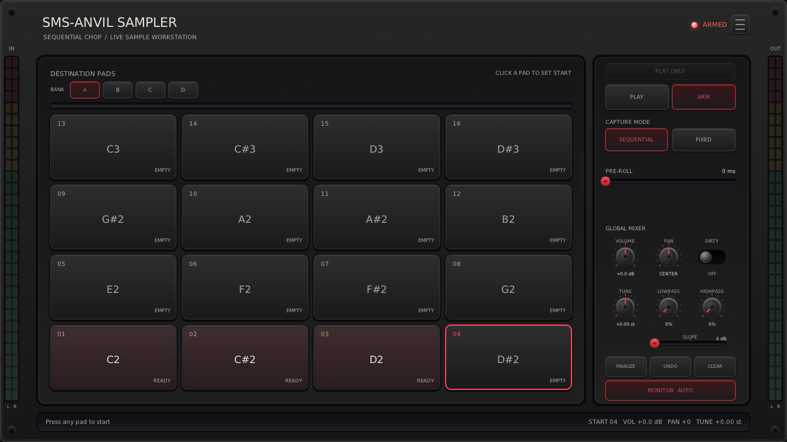
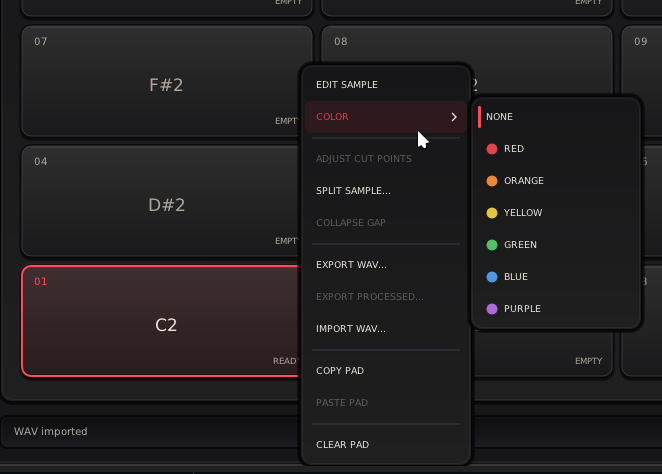
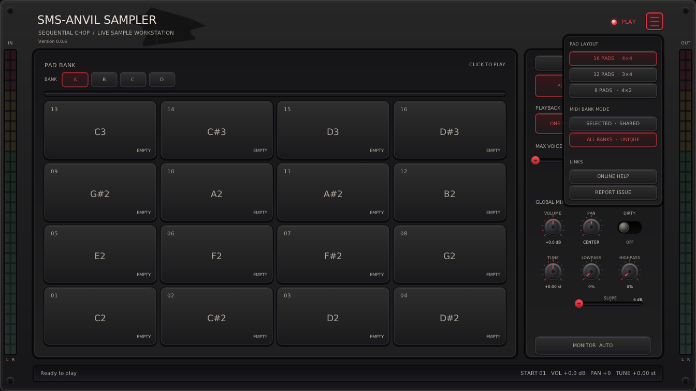
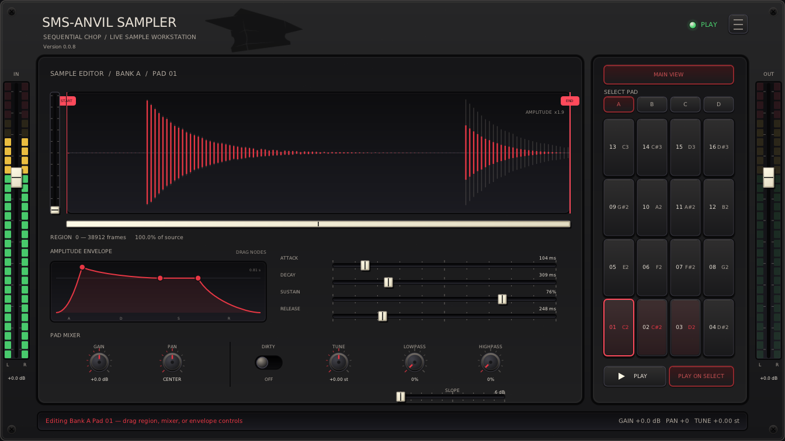
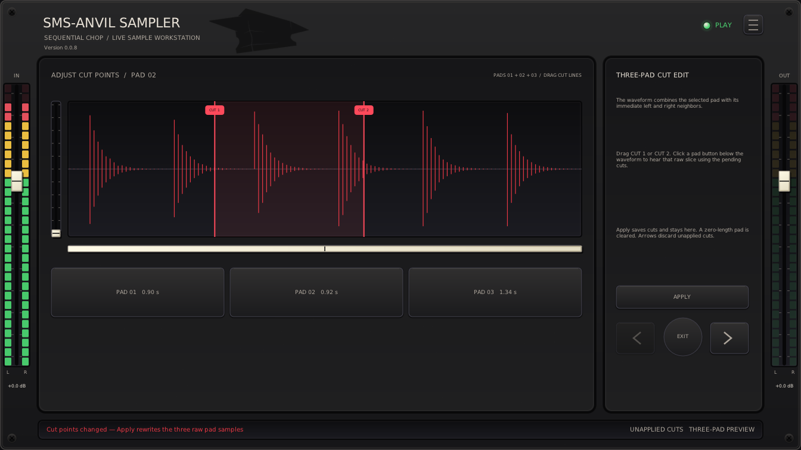
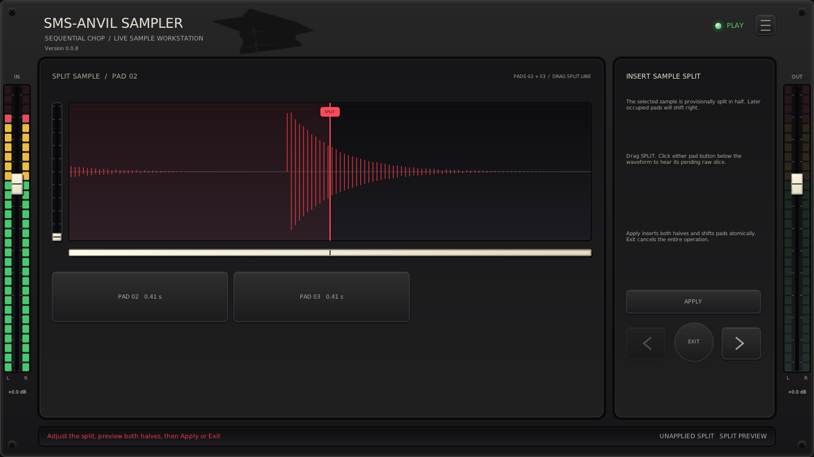

# SMS-Anvil Sampler

_A live stereo chopping sampler for Linux._

> Special thanks to **Manolo Anville** ([@ManoloAnville](https://github.com/ManoloAnville)) for collaboration.



**VST3 is the preferred version.** Its GUI loads faster than LV2, and it has been generally human-tested the most. LV2 is mostly AI-tested, and CLAP (if even made available) has NOT been tested.

Tested in **REAPER**, **Ardour**, and **Carla**.

- Control with any MIDI controller.
- Record input and quickly chop input to pads, or load samples to pads.
- Basic waveform editing and splitting.
- Pad/global mixer/FX: Gain, Pan, Dirty, Tune (Varispeed), and Lowpass/Highpass with 6/12/24 dB slopes; separate monitor and playback levels.
- Sample specific amplitude envelope; Attack, Decay, Sustain, Release.
- Layout options to match physical gear (2x4, 3x4, 4x4 pads), with 4 banks in shared/unique mode; and possibility to assign colors for pads.
- VST3 presets store samples/settings across supported DAWs: Ardour presets also
  load in REAPER and vice versa. Carla does not support them.

> Versions 1.0.0+ are not backwards compatible with alpha releases (v0.0.1-v0.0.9). Alpha releases have been removed from GitHub releases to avoid confusion.

## Basic Usage

1. Insert **SMS-Anvil Sampler** on a stereo REAPER track receiving audio and MIDI; or on MIDI-track in Ardour, with stereo input sidechain. Stereo input is necessary only if chopping live audio into its pads.

2. Press **ARM** (red record circle) to arm; release it for PLAY.
   The header light/text is red when ARMED and green in PLAY.
   The first empty visible pad is selected; click another while idle to override it.

3. **The first MIDI note-on or Space press starts the slice.** Later taps close
   the current slice and continue at the next pad.
    > NOTE: **ANY** MIDI note-on (i.e. any pad of your controller) starts and chops.

4. **FINALIZE** or releasing **ARM** keeps the open slice. **UNDO** discards the
   open/last slice; **CLEAR** clears all banks after a confirmation click.

5. Right click on a pad to edit the sample, split it to neighbouring pads, or adjust the existing cut points with neighbouring pads.



Right click on a PAD reveals context menu with various operations.



The hamburger menu has layout and bank mode selection. **Online Help** opens this
guide from the matching tag in official releases, or from `main` in development
builds. **Report Issue** opens the project's issues page.

Select **All Banks** (unique notes, default) for gapless notes or **Selected Bank**
(shared notes) for playing a sample with "bank A notes", based on currently active bank. All Banks limits the base note to 64.

Layouts show 16, 12, or 8 pads; for best experience, choose what fits best with your physical controller. Changing the layout is non-destructive for existing samples.



**SAMPLE EDITOR** opens waveform, ADSR, and pad mixing; **MAIN VIEW** returns. See the
[mixing guide](Docs/MIXING.md). **Play on Select** auditions selections. **Play/Stop** plays the selected occupied pad when idle or immediately cuts all
playing samples. In Sample Editor it plays the open sample.
The button shows a play triangle or stop square. ARM hides the global mixer.
The edge faders remain visible: **IN** controls monitoring, **OUT** controls
samples/previews.

Over the waveform, **Ctrl + wheel** zooms and **Shift + wheel** scrolls; or drag the left vertical zoom control or the horizontal window box below the
waveform. The box shows the visible range. Changing pads resets the view.



Right-click a middle pad for **Adjust cut points**. See the
[cut-point guide](Docs/CHOP-EDITOR.md).



### General Controls

- Drag/wheel knobs and sliders.
- **Shift** gives 10× knob precision; **Ctrl** steps e.g. Gain/Volume 1 dB, Pan 10%, and Tune one semitone.
- Double-click values for exact entry.
- Double/middle-click knobs, ADSR sliders, or edge faders to reset.
- The wheel also adjusts ADSR, Start/End, and cut points.
- Click the plug-in for keyboard focus. **Space** plays/stops in
  PLAY and Sample Editor, or starts/chops capture in ARM. Holding Space does not
  repeat. Menus, file dialogs, numeric entry, and cut-point views suppress it.
  The plug-in consumes Space when delivered; a DAW that intercepts keyboard
  shortcuts first may require its option to send keys to the plug-in.

## Other good-to-know
- Total sample memory is approx 8 minutes.

- Monitor cycles through Off, On, and Auto; Auto is On when ARMed and Off otherwise.

- Max Voices limits simultaneous pads. At the limit, a new trigger stops the
oldest voice; set it to one for monophonic playback.

- Pre-roll moves boundaries slightly earlier to compensate for late taps. Fixed
mode records one fixed-length slice per note-on.

- New sessions start with Auto monitoring, one voice, Play on Select enabled,
and 6 dB/octave filter slopes.

- Right-click pads to copy, paste, import, export, clear, split, or collapse a gap.
  Split Sample and Collapse Gap stay within the active bank. A copied pad can be
  pasted into another bank.

- Right-click a pad for **Color**; its tint is saved, even when empty.

- See [WAV files](Docs/WAV-FILES.md) for supported import formats and Linux requirements.

- Samples from all four banks are
stored with the DAW project as 16-bit stereo state.

- Stereo LED rails around the faders show raw input and final output.

Splitting a sample shifts possible neighbouring following samples to right.



## Vision, Contributions, License

For development and host/UI testing, see [Contributing](../CONTRIBUTING.md).

Licensed under the [MIT License](LICENSE).

See [Docs/VISION.md](Docs/VISION.md) for product direction and feature scope.

## Build

Ubuntu/Debian prerequisites:

```bash
sudo apt install build-essential cmake ninja-build pkg-config git python3 \
  lv2-dev libgl1-mesa-dev libx11-dev libxext-dev \
  libxrandr-dev libxcursor-dev libxinerama-dev libdbus-1-dev xdg-utils
```

From the repository root:

```bash
git submodule update --init --recursive
cmake -S SMS-AnvilSampler -B build -G Ninja \
  -DCMAKE_BUILD_TYPE=Release -DBUILD_TESTING=ON \
  -DANVILSAMPLER_BUILD_VST3=ON
cmake --build build
ctest --test-dir build --output-on-failure
```

The VST3 and LV2 bundles are produced under `build/bin`. Install them for the
current user with:

```bash
mkdir -p ~/.lv2
cp -a build/bin/SMS-AnvilSampler.lv2 ~/.lv2/
mkdir -p ~/.vst3
cp -a build/bin/SMS-AnvilSampler.vst3 ~/.vst3/
```
