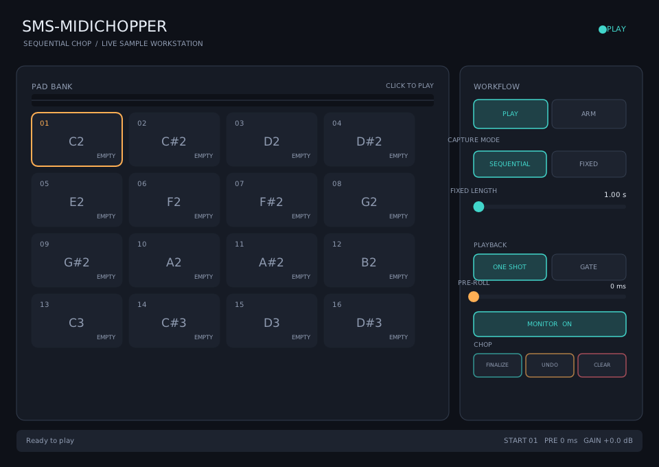

# SMS-Midichopper

A live stereo chopping sampler for Linux. Arm it, start the vinyl or other
audio source, and tap any MIDI pad at each slice boundary. Every tap finishes
the current slice and continues recording onto the next pad.

> **Disclaimer:** This is an AI-generated project, created under the supervision
> and testing of [SirSipe](https://github.com/sirsipe/).



_Screenshot from version v0.0.1._

## Vision

See [Docs/VISION.md](Docs/VISION.md) for the product vision and the principles
that guide development. All feature requests must fit that vision or they will
be rejected.

## Build

Ubuntu/Debian prerequisites:

```bash
sudo apt install build-essential cmake ninja-build pkg-config git \
  lv2-dev libgl1-mesa-dev libx11-dev libxext-dev \
  libxrandr-dev libxcursor-dev libxinerama-dev
```

```bash
git submodule update --init --recursive
cmake -S . -B build -G Ninja -DCMAKE_BUILD_TYPE=Release
cmake --build build
ctest --test-dir build --output-on-failure
```

The plug-in is produced at `build/bin/SMS-Midichopper.lv2`. Install it for
the current user with:

```bash
mkdir -p ~/.lv2
cp -a build/bin/SMS-Midichopper.lv2 ~/.lv2/
```

## Use

1. Insert **SMS-Midichopper** on a stereo Reaper track receiving audio and MIDI.
2. Select the first destination pad, enable monitoring if needed, then click **ARM**.
3. The first MIDI note-on starts the first slice. Each later note-on closes that
   slice and immediately starts the next consecutive pad.
4. Click **FINALIZE** or return to **PLAY** to keep the last open slice.
5. Play pads from MIDI note 36 upward; the base note is configurable.

Open **Sample Editor** to move the pad bank into the right panel and edit the
selected pad in the main view. Drag the waveform's start/end handles to choose
the playback region, then adjust attack, decay, sustain, and release. These
settings are stored independently for every pad and do not alter captured audio.

Max Voices limits how many pads may play simultaneously. When the limit is
reached, triggering another pad stops the oldest playing voice; setting it to
one provides monophonic playback.

Pre-roll moves boundaries slightly earlier to compensate for late taps. Fixed
mode records one fixed-length slice per note-on. Samples are stored with the DAW
project as compact 16-bit stereo state.

See [Docs/ARCHITECTURE.md](Docs/ARCHITECTURE.md) for implementation details and
future-format notes. Licensed under the [MIT License](LICENSE).
