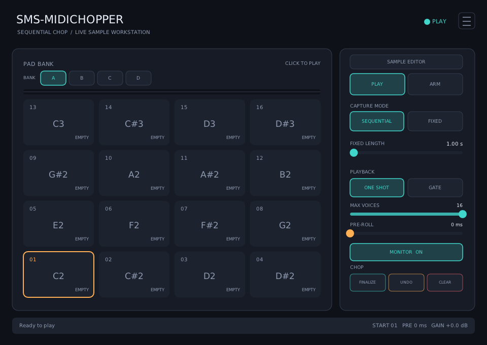

# SMS-Midichopper

A live stereo chopping sampler for Linux. Arm it and tap a MIDI pad: the first
tap starts recording; later taps finish a slice and advance.

> **Disclaimer:** This is an AI-generated project, created under the supervision
> and testing of [SirSipe](https://github.com/sirsipe/).



_Screenshot from version v0.0.3._

## Vision

See [Docs/VISION.md](Docs/VISION.md) for product direction and feature scope.

## Build

Ubuntu/Debian prerequisites:

```bash
sudo apt install build-essential cmake ninja-build pkg-config git \
  lv2-dev libgl1-mesa-dev libx11-dev libxext-dev \
  libxrandr-dev libxcursor-dev libxinerama-dev libdbus-1-dev
```

From the repository root:

```bash
git submodule update --init --recursive
cmake -S SMS-Midichopper -B build -G Ninja -DCMAKE_BUILD_TYPE=Release -DBUILD_TESTING=ON
cmake --build build
ctest --test-dir build --output-on-failure
```

The plug-in is produced at `build/bin/SMS-Midichopper.lv2`. Install it for
the current user with:

```bash
mkdir -p ~/.lv2
cp -a build/bin/SMS-Midichopper.lv2 ~/.lv2/
```

## Use

1. Insert **SMS-Midichopper** on a stereo Reaper track receiving audio and MIDI.
2. Choose a bank, enable monitoring if needed, then click **ARM**. The first
   empty visible pad is selected; click another pad while idle to override it.
3. The first MIDI note-on starts the slice. Later note-ons close the current
   slice and continue at the next pad; their note identity does not choose it.
4. Click **FINALIZE** or return to **PLAY** to keep the last open slice.
5. Select Bank A–D and play from MIDI note 36 upward. The base is configurable.

The hamburger menu provides two MIDI bank modes. **All Banks** (the default)
assigns stable, gapless notes to exposed sample slots. **Selected Bank** reuses
the base-note range for the visible bank. A note-on activates its bank and the
UI follows it.
Layout changes regroup slots without changing notes. All Banks limits the
effective base to 64 so every layout fits MIDI 0–127.

The pad layout supports 16 pads (4×4), 12 pads (3×4), and 8 pads (4×2), numbered
from the bottom row. Banks retain 16 slots; smaller layouts hide slots without
deleting samples. Sequential capture skips hidden slots and continues into the
next bank in Selected Bank mode. All Banks uses contiguous layout-sized pages.

In Play, open **Sample Editor** for non-destructive region and ADSR editing.
Side-panel clicks select and load pads. Enable **Play on Select** below the pads
to audition them as you select them; it defaults to off whenever
the plug-in UI opens. MIDI playback selects populated pads, including retriggers.
The editor is unavailable in Arm so capture controls remain visible.

Open **Chop Editor** for raw, layout-aware boundary correction across adjacent
pads. See the [Chop Editor guide](Docs/CHOP-EDITOR.md).

Hovering highlights the enabled control under the pointer. The mouse wheel
adjusts Fixed Length, Max Voices, Pre-roll, and editor ADSR sliders.
Arm shows Capture Mode and Pre-roll, plus Fixed Length only for Fixed capture.
Play shows playback mode and Max Voices. Hidden controls retain their values.

In Play or Sample Editor, right-click a pad to copy, paste, import, export, or
clear it. See
[WAV files](Docs/WAV-FILES.md) for formats and Linux requirements. **Clear Pad**
requires confirmation.

Max Voices limits simultaneous pads. At the limit, a new trigger stops the
oldest voice; set it to one for monophonic playback.

Pre-roll moves boundaries slightly earlier to compensate for late taps. Fixed
mode records one fixed-length slice per note-on. Samples from all four banks are
stored with the DAW project as compact 16-bit stereo state.

Stereo LED rails show raw input on the left and final output on the right in
every mode, even with monitoring off. Yellow begins at −18 dBFS and red at
−6 dBFS.

For development and host/UI testing, see [Contributing](../CONTRIBUTING.md).
Licensed under the [MIT License](LICENSE).
