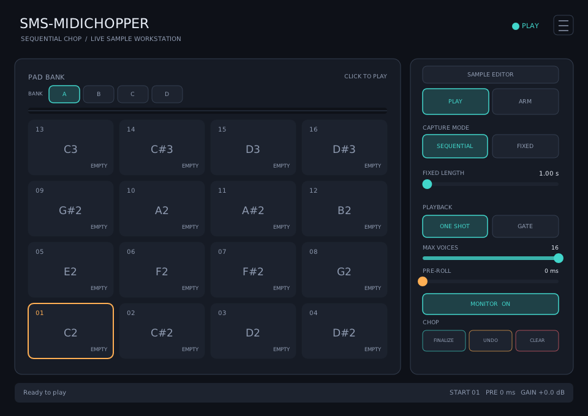

# SMS-Midichopper

A live stereo chopping sampler for Linux. The first armed MIDI tap records;
later taps split and advance.

> **Disclaimer:** This is an AI-generated project, created under the supervision
> and testing of [SirSipe](https://github.com/sirsipe/).



## Vision

See [Docs/VISION.md](Docs/VISION.md) for product direction and feature scope.

## Build

Ubuntu/Debian prerequisites:

```bash
sudo apt install build-essential cmake ninja-build pkg-config git \
  lv2-dev libgl1-mesa-dev libx11-dev libxext-dev \
  libxrandr-dev libxcursor-dev libxinerama-dev libdbus-1-dev
```

From the repository root:

```bash
git submodule update --init --recursive
cmake -S SMS-Midichopper -B build -G Ninja -DCMAKE_BUILD_TYPE=Release -DBUILD_TESTING=ON
cmake --build build
ctest --test-dir build --output-on-failure
```

The plug-in is produced at `build/bin/SMS-Midichopper.lv2`. Install it for
the current user with:

```bash
mkdir -p ~/.lv2
cp -a build/bin/SMS-Midichopper.lv2 ~/.lv2/
```

## Use

1. Insert **SMS-Midichopper** on a stereo Reaper track receiving audio and MIDI.
2. Choose a bank, set monitoring if needed, then click **ARM**. The first
   empty visible pad is selected; click another pad while idle to override it.
3. The first MIDI note-on starts the slice. Later note-ons close the current
   slice and continue at the next pad; their note identity does not choose it.
4. Click **FINALIZE** or return to **PLAY** to keep the last open slice.
5. Select Bank A–D and play from MIDI note 36 upward. The base is configurable.

The menu selects **All Banks** (gapless notes, default) or **Selected Bank**
(shared notes). All Banks limits the base note to 64.

Layouts show 16, 12, or 8 pads without deleting hidden samples.

**Sample Editor** shows waveform, ADSR, and pad mixing. See the
[mixing guide](Docs/MIXING.md).
**Play on Select** auditions selections. Arm hides the editor.
**Play/Stop** plays the selected occupied pad when idle or immediately cuts all
playing samples. In Sample Editor it plays the open sample.
Over the waveform, **Ctrl + wheel** zooms and **Shift + wheel** scrolls.
Drag the left vertical zoom control or the horizontal window box below the
waveform. The box shows the visible range. Changing pads resets the view.

Right-click a middle pad for **Adjust cut points**. See the
[cut-point guide](Docs/CHOP-EDITOR.md).

Drag or wheel knobs and the Fixed Length, Max Voices, and Pre-roll sliders.
**Shift** gives 10× knob precision; **Ctrl** steps Gain/Volume 1 dB, Pan 10%,
and Tune one semitone. Double-click a value to type; double-click or
middle-click to reset. The wheel also adjusts ADSR, Start/End, and cut points.
Monitor cycles through Off, On, and Auto; Auto passes input while armed.
New sessions start with Auto monitoring, one voice, Play on Select enabled,
and 6 dB/octave filter slopes.

Right-click pads to copy, paste, import, export, clear, split, or collapse a gap.
Both stay within the bank. See
[WAV files](Docs/WAV-FILES.md) for formats and Linux requirements.

Right-click a pad for **Color**; its tint is saved, even when empty.

Max Voices limits simultaneous pads. At the limit, a new trigger stops the
oldest voice; set it to one for monophonic playback.

Pre-roll moves boundaries slightly earlier to compensate for late taps. Fixed
mode records one fixed-length slice per note-on. Samples from all four banks are
stored with the DAW project as 16-bit stereo state.

Stereo LED rails show raw input and final output, even with monitoring off.

For development and host/UI testing, see [Contributing](../CONTRIBUTING.md).
Licensed under the [MIT License](LICENSE).
